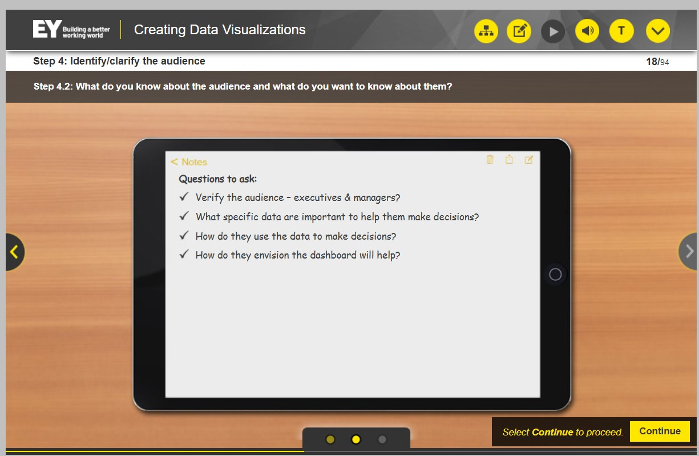

## Cenário de Prática n.1

Nesta prática, você verá uma história baseada em projetos e exemplos reais da EY. A história será apresentada em seções, e você será solicitado a responder a uma pergunta com base nas informações fornecidas no momento. À medida que a história avança, você obterá mais informações que lhe darão insights sobre a visualização de dados.

- Mantenha o guia de tarefas aberto durante toda a lição.

## Cenario

### 1. Etapa: Revise as informações disponíveis

- Hugo, um funcionário da EY, começa o dia revisando seus e-mails.

- Ele abre um e-mail enviado por Mai, sua gerente.

-  Mai lhe enviou a tarefa de criar um painel para a Dante Insurance Corporation.

### 2. Etapa: Faça anotações e anote as perguntas
Faça anotações e anote as perguntas que você não consegue responder enquanto revisa e reúne informações sobre contexto, público e objetivos para ajudar a planejar sua visualização.

### 3. Etapa: Analisar o email de Gilbert e identificar informações

Hugo percebe que não há informações suficientes no documento de histórico para fornecer as informações que ele procura e decide analisar o e-mail do cliente com mais detalhes.

"Hugo: Deixe-me analisar o e-mail do Gilbert e identificar informações que me ajudem a entender a necessidade do cliente."

#### 4. Etapa: Usar o guia de tarefas

- Visão geral: Seu trabalho começa quando você é solicitado a criar uma visualização de dados. Às vezes, você receberá informações sobre o projeto para ajudá-lo a entender melhor o requisito e, outras vezes, precisará pedir esclarecimentos. Em ambos os casos, você precisará garantir que compreende o contexto da visualização e é capaz de identificar o público-alvo e o objetivo da visualização.   
- Ao analisar a visualização de dados e quaisquer outras informações que você tenha recebido sobre o projeto, é sempre útil fazer anotações e anotar perguntas à medida que você coleta informações sobre contexto, público e objetivo(s) para ajudá-lo a estruturar a história da visualização de dados.  
- Instruções: Abaixo estão as etapas gerais para identificar contexto, público e objetivo. Você deve usar esta lista de verificação enquanto trabalha na prática do cenário. Ao passar por cada etapa, marque a caixa à direita para indicar que ela foi concluída. Você pode anotar quaisquer anotações/comentários que achar úteis na seção de comentários. Você pode imprimir este guia de tarefas para sua conveniência.

#### 5. Etapa: Anotações

No e-mail enviado ao Hugo, o cliente solicitou um painel que incluísse: 
- Perdas e ganhos por região; 
- visão geral operacional da empresa;
-  perdas com sinistros, despesas por linha de negócios e/ou produto e KPIs.
- O público é de nível executivo, mas parece que os gerentes também podem usar o painel, já que estão solicitando filtros mais detalhados.

#### 6. Etapa: Perguntas a serem feitas

#### Perguntas a serem feitas:

- Verificar o público – executivos e gerentes?
- Quais dados específicos são importantes para ajudá-los a tomar decisões?
- Como eles usam os dados para tomar decisões?
- Como eles imaginam que o painel ajudará?

#### O público usará as informações para (precisa verificar):

- Tomar decisões sobre ofertas de planos em mercados
- Identificar se linhas de negócios específicas apresentam tendências de perdas ou ganhos por região
- Tomar decisões para retirar serviços de um mercado