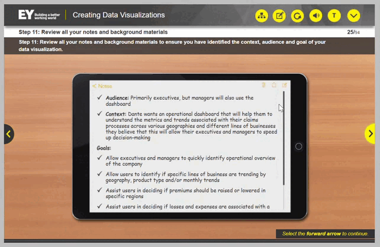

## Cenário de Prática n.1

Nesta prática, você verá uma história baseada em projetos e exemplos reais da EY. A história será apresentada em seções, e você será solicitado a responder a uma pergunta com base nas informações fornecidas no momento. À medida que a história avança, você obterá mais informações que lhe darão insights sobre a visualização de dados.

- Mantenha o guia de tarefas aberto durante toda a lição.

## Cenario

### 1. Etapa: Revise as informações disponíveis

- Hugo, um funcionário da EY, começa o dia revisando seus e-mails.

- Ele abre um e-mail enviado por Mai, sua gerente.

-  Mai lhe enviou a tarefa de criar um painel para a Dante Insurance Corporation.

### 2. Etapa: Faça anotações e anote as perguntas
Faça anotações e anote as perguntas que você não consegue responder enquanto revisa e reúne informações sobre contexto, público e objetivos para ajudar a planejar sua visualização.

### 3. Etapa: Analisar o email de Gilbert e identificar informações

Hugo percebe que não há informações suficientes no documento de histórico para fornecer as informações que ele procura e decide analisar o e-mail do cliente com mais detalhes.

"Hugo: Deixe-me analisar o e-mail do Gilbert e identificar informações que me ajudem a entender a necessidade do cliente."

#### 4. Etapa: Usar o guia de tarefas

- Visão geral: Seu trabalho começa quando você é solicitado a criar uma visualização de dados. Às vezes, você receberá informações sobre o projeto para ajudá-lo a entender melhor o requisito e, outras vezes, precisará pedir esclarecimentos. Em ambos os casos, você precisará garantir que compreende o contexto da visualização e é capaz de identificar o público-alvo e o objetivo da visualização.   
- Ao analisar a visualização de dados e quaisquer outras informações que você tenha recebido sobre o projeto, é sempre útil fazer anotações e anotar perguntas à medida que você coleta informações sobre contexto, público e objetivo(s) para ajudá-lo a estruturar a história da visualização de dados.  
- Instruções: Abaixo estão as etapas gerais para identificar contexto, público e objetivo. Você deve usar esta lista de verificação enquanto trabalha na prática do cenário. Ao passar por cada etapa, marque a caixa à direita para indicar que ela foi concluída. Você pode anotar quaisquer anotações/comentários que achar úteis na seção de comentários. Você pode imprimir este guia de tarefas para sua conveniência.

#### 5. Etapa: Anotações

No e-mail enviado ao Hugo, o cliente solicitou um painel que incluísse: 
- Perdas e ganhos por região; 
- visão geral operacional da empresa;
-  perdas com sinistros, despesas por linha de negócios e/ou produto e KPIs.
- O público é de nível executivo, mas parece que os gerentes também podem usar o painel, já que estão solicitando filtros mais detalhados.

#### 6. Etapa: Perguntas a serem feitas

#### Perguntas a serem feitas:

- Verificar o público – executivos e gerentes?
- Quais dados específicos são importantes para ajudá-los a tomar decisões?
- Como eles usam os dados para tomar decisões?
- Como eles imaginam que o painel ajudará?

#### O público usará as informações para (precisa verificar):

- Tomar decisões sobre ofertas de planos em mercados
- Identificar se linhas de negócios específicas apresentam tendências de perdas ou ganhos por região
- Tomar decisões para retirar serviços de um mercado
- Esses executivos não estão realmente preocupados com detalhes, apenas com os KPIs finais.
- Os gerentes da Dante trabalhariam com vendas e fornecedores para acertar os custos em um mercado específico dentro de um estado.
- Os detalhes são importantes para eles, mas precisariam de uma interface simples. Muitos deles não são tão entendidos em tecnologia, mas gostam de ter os dados.

#### Objetivos a serem verificados

#### Informacoes obtidas atraves da conversa com Diana

Hugo revisa suas anotações. Há algumas perguntas que ele não consegue responder e outras que precisa de esclarecimentos com base nas informações que possui atualmente.

- Ele precisará analisar se há itens adicionais para adicionar a esta lista. Usando seu auxiliar de trabalho, Hugo descobre que deve pesquisar as perguntas.

Ele encontra relatórios financeiros e notícias de acesso público sobre o desempenho de Dante na web. Um relatório financeiro recente sobre o aumento dos custos de sinistros de Dante é de particular interesse e lhe dá uma visão sobre alguns dos problemas comerciais de Dante. Hugo adiciona essas informações ao seu bloco de notas.

Hugo e Diane se encontram para discutir a necessidade do painel de controle de Dante. Ouça a conversa deles e anote, se necessário.

— Hugo: Olá, Diane! Obrigado por reservar um tempo para conversar comigo sobre isso.

— Diane: Claro, Hugo. A qualquer momento.

— Hugo: Bem, você deve saber que me pediram para trabalhar no painel de controle de Dante.

— Diane: Sim, ouvi falar disso. Parabéns!

— Hugo: Obrigado. Estou apenas começando agora e analisando o documento de histórico para garantir que entregamos o que o cliente realmente precisa.

— Diane: Aham.

— Hugo: As informações de histórico e os e-mails dos clientes me deram algumas informações sobre contexto, público-alvo e objetivo para ajudar a direcionar a criação do painel, e também fiz algumas pesquisas online.

— Diane: Certo.

— Hugo: Sei que você trabalhou bastante com a Dante e conhece bem os dados deles. Há alguma informação adicional importante que eu deva saber sobre a empresa?

— Diane: Bem, eu sei que a Dante tem enfrentado dificuldades com os custos de processamento de sinistros há algum tempo. Eles têm tentado identificar tendências de perdas e têm enfrentado dificuldades porque os dados de que precisam estão espalhados em diferentes sistemas e ainda não encontraram uma solução, mas acho que é aí que você entra. No momento, eles podem visualizar as perdas de processamento de sinistros associadas a diferentes tipos de planos; no entanto, precisam ser capazes de visualizar suas perdas por ramo de atividade e as tendências por estado.

- Hugo adiciona isso às suas anotações.

— Hugo: Tem mais alguma coisa em que você possa pensar?

— Diane: Não, na verdade não. Não estou diretamente envolvido no projeto do painel, então não sei se posso ajudar com suas outras perguntas.

— Hugo: Obrigado, Diane. As informações que você me deu foram muito úteis.

— Diane: Claro, Hugo. A qualquer momento.

#### Questoes de negocios a serem respondidas

- Mesmo depois de conversar com Diane, Hugo ainda tem algumas perguntas que não consegue responder. Ele pensa se os membros mais experientes da equipe poderiam ajudar.

- Hugo envia um e-mail para Mai para verificar se ela tem alguma outra informação sobre Dante que possa ajudá-lo a refinar as metas e responder a algumas de suas perguntas pendentes.

- Ele recebe uma resposta imediata.   

- Embora Hugo tenha coletado informações úteis, ele ainda precisa ter clareza sobre como Dante espera que o painel os ajude.

- Ele envia um e-mail ao seu gerente de projetos informando que gostaria de marcar uma reunião com Gilbert Sullivan e o convida para a reunião antes de entrar em contato com o cliente.

#### Aqui estão os principais pontos de aprendizado desta lição

Os 12 passos para identificar o Contexto, o Público e o Objetivo de uma visualização de dados:

1. Revise as informações disponíveis;
2. Faça anotações e anote perguntas;
3. Identifique o contexto;
4. Identifique o público;
5. Identifique o objetivo;
6. Pesquise o assunto;
7. Busque a ajuda de um membro mais experiente;
8. Ligue/envie um e-mail para o gerente de engajamento sobre o contato com o cliente;
9. Envie um e-mail/ligue para o cliente;
10. Faça perguntas esclarecedoras ao cliente;
11. Revise todas as suas anotações e materiais de apoio;
12. Se as informações ainda não estiverem disponíveis, entre em contato com o responsável pelo projeto.
