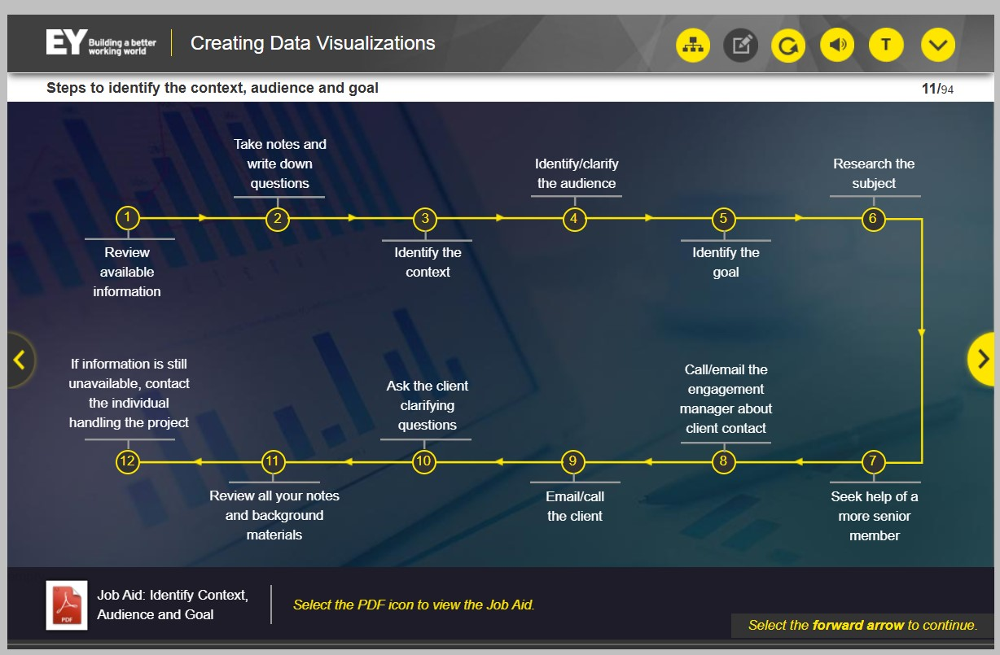

Aqui estão as 12 etapas envolvidas na identificação do contexto, público e objetivo de uma visualização de dados.

Consulte o guia de tarefas para obter a lista detalhada das etapas. Selecione o ícone PDF para visualizar o guia de tarefas.

