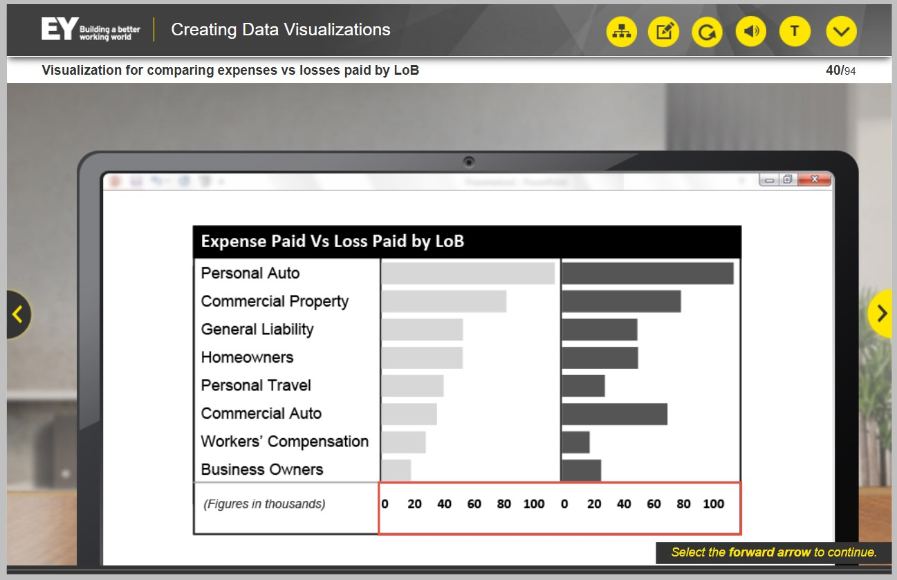

## Lição 2 – Identificar tipos visuais apropriados, você praticará como selecionar os tipos visuais apropriados para uma visualização de dados.

### Ao final desta lição, você será capaz de:

• Identificar os tipos visuais apropriados que são mais adequados
para os dados apresentados

Um aspecto fundamental da construção de uma visualização de dados é selecionar o tipo visual para cada conjunto de dados que você precisa exibir.

Nesta lição, você:

- Receberá um material de apoio como referência
- Será apresentado a um cenário no qual Hugo precisa selecionar os recursos visuais apropriados, utilizando as estratégias apresentadas no material de apoio

### Alguns gráficos apropriados para visualização

— Hugo: Agora que dei uma olhada nas minhas
anotações, é melhor eu fazer uma lista de dados
que acho que precisam ser exibidos
no painel para que eu possa
começar a selecionar os recursos visuais certos
para minha história de dados.

Após identificar o contexto, o público-alvo e o objetivo do painel Dante, Hugo precisa agora identificar os tipos visuais a serem usados ​​na visualização de dados.

Antes de começar a selecionar os visuais, Hugo dedica um momento para revisar o que sabe sobre o cliente e seus objetivos.

**Aqui está a lista elaborada por Hugo.**

— Hugo: Os dados mais importantes parecem ser os KPIs, então deixe-me começar com eles.

Hugo: Então, posso usar uma etiqueta com os números dos KPIs.

Eles querem ver dados relacionados ao período atual e aos anteriores. Mas, como o **período atual** é mais importante, vou destacar mais esse número.

- Custos de tratamento de sinistros;
- perdas incorridas;
- reserva de despesas; 
- despesas pagas e índice de despesas

 são itens importantes para os executivos. Criarei a mesma visualização para esses itens também.

 ### O que os executivos querem ver

 Os executivos da Dante também querem ver a tendência de doze meses em cada um desses KPIs. Deixe-me ver qual seria a melhor maneira de apresentar esses dados. Deixe-me consultar o guia de tarefas.

 

 - Grafico mais adequado : **Grafico de Linha.**

 

 ### Dados por Estado

 Preciso descobrir como representar os dados por estado. Deixe-me voltar ao meu guia de tarefas e ver o que ele recomenda.

 

 — Hugo: A dica 5 é sobre dados de séries temporais e a dica 6 é sobre gráficos de área.

- Gráficos de barras verticais e gráficos de área realmente não funcionam para isso.

- Talvez uma variação do mapa de calor da dica 3 seja a melhor escolha.

— Hugo: Posso mostrar o mapa e usar codificação por cores para comparar os KPIs de estado para estado. Isso deve apresentar uma imagem clara do desempenho de lucros e perdas por estado. Forneceremos um recurso que permite aos usuários clicar em cada estado para fornecer métricas mais detalhadas para aquele estado. Assim, os gerentes de departamento poderão investigar tendências com mais detalhes.

### Desempenho de cada plano nos últimos 18 meses

— Hugo: Preciso criar uma visualização para mostrar o desempenho de cada plano nos últimos 18 meses. Acredito que executivos e gerentes de departamento vão querer ver essas informações todos os meses.

Provavelmente posso criar um indicador para cada plano que mostre esses dados, mas deixe-me consultar o guia de tarefas e ver qual visualização seria melhor.

Agora, o Hugo precisa identificar a melhor visualização para o desempenho do plano por tipo de plano.

— Hugo: Esqueci que os indicadores consomem muita tinta de dados!

O que mais posso usar para fornecer dicas visuais rápidas para esse público que ajudem a direcionar a atenção deles para o que eu preciso que eles vejam?

Ah, entendi! Como o desempenho do plano também está comparando dados e precisamos ver as mudanças rapidamente, outro mapa de calor provavelmente será a melhor opção.

Posso organizá-lo com os meses no topo, mostrar os planos ao longo do eixo y e codificar o desempenho por cores. Isso facilitará a visualização das mudanças e tendências por plano.

Acho que a última visualização que os executivos queriam era uma comparação entre despesas pagas e perdas pagas por linha de negócios.

- Isso precisará incluir uma escala mostrando dados financeiros em milhões de dólares, então nenhuma das visualizações que criei até agora funcionaria. Deixe-me olhar o guia de tarefas novamente.

- Vejo no guia de tarefas que a dica 8 recomenda o uso de gráficos de barras para comparar dados.

Eu poderia usar gráficos de barras para representar despesas versus perdas pagas por linha de negócios.

Eu poderia mostrar os gráficos lado a lado. Um gráfico para despesas e outro para perdas. 

Posso ter as linhas de negócios no eixo vertical como rótulos para ambos os gráficos. Na parte inferior, mostrarei as faixas de despesas e perdas para cada gráfico.

### Visualização de filtros para apresentar métricas de LoB e produtos vendidos

— Hugo: Precisarei reservar espaço para filtros, já que os gerentes de departamento provavelmente desejarão se aprofundar em cada um dos gráficos e alguns executivos podem querer ver os gráficos alinhados a outros indicadores de desempenho.

— Hugo: Isso abrange minhas principais visualizações:

— Hugo: Deixe-me voltar ao guia de tarefas para ver se esqueci de alguma coisa. Não usarei gráficos de pizza, gráficos de rosca, gráficos 3D ou medidores.

As dicas **16** e **17** servem como lembretes para que eu considere se a visualização transmitirá as mensagens-alvo ao público.

Hugo combina os KPIs e o gráfico de linhas para indicar a tendência de doze meses para os executivos. Mas ele não parece satisfeito com isso.

— Hugo: Não tenho certeza se este gráfico mostra a tendência de doze meses para os executivos de forma suficientemente boa. O gráfico de linhas é bom, mas não dá uma noção precisa da escala do que o gráfico significa.

Se eu adicionar uma porcentagem resumida, ela mostrará a movimentação dos dados ao longo do tempo e também indicará imediatamente o que o gráfico de linhas significa. Isso é muito melhor e mostrará exatamente a história geral do desempenho para os executivos.

Hugo identificou os tipos de visualização que deseja usar na visualização de dados. Agora, ele está pronto para começar a trabalhar no layout da visualização de dados.

### Conclusão da licão 2

Aqui estão os principais pontos de aprendizagem desta lição.

