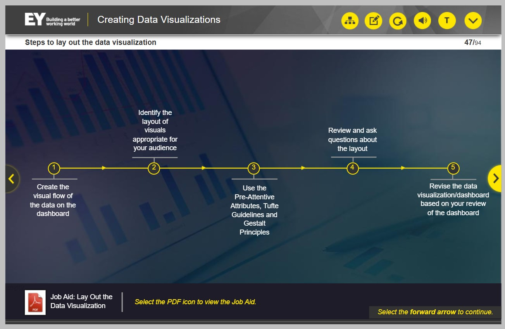
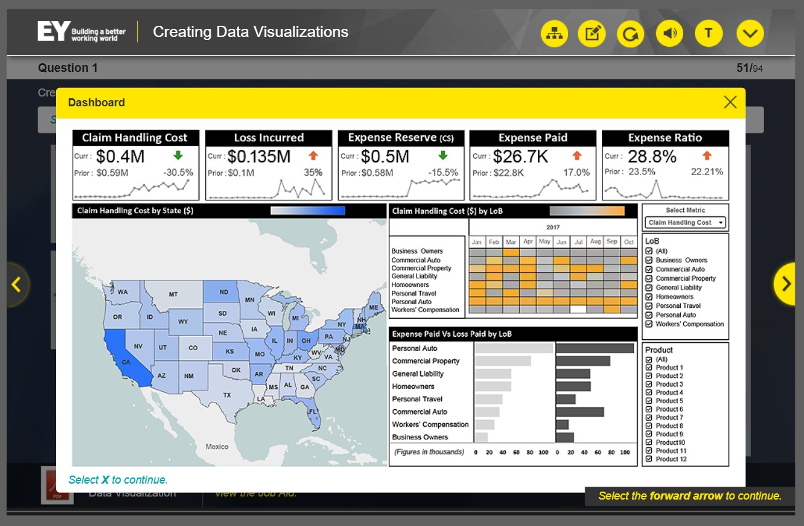
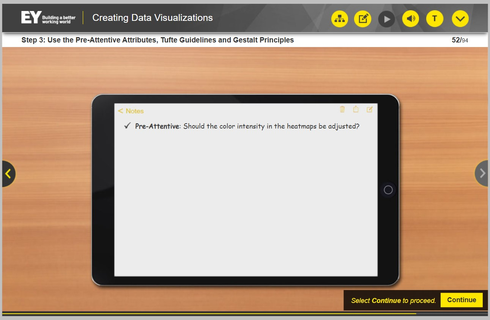
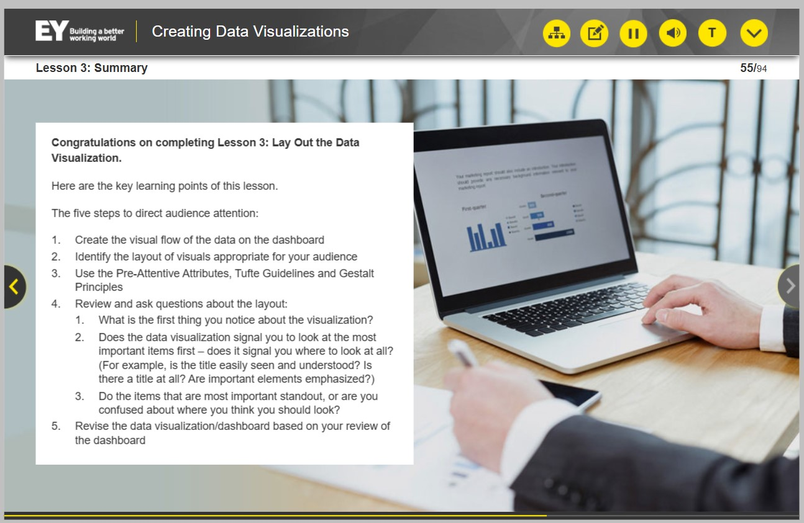

## Lição 3 – Esquematize a visualização de dados

 Você praticará como direcionar a atenção para o público-alvo (executivo, departamental e analista) e garantirá que os elementos de design sejam apropriados na sua visualização de dados.

 Após identificar os recursos visuais apropriados para um dashboard, você precisa apresentar os recursos visuais selecionados de forma a direcionar a atenção do público para as informações mais importantes na tela.

Nesta lição, você:

- Apresentará estratégias para direcionar a atenção do público usando um guia de tarefas
- Será apresentado a um cenário em que um funcionário da EY tenta apresentar recursos visuais de um dashboard

### Etapas para definir a visualização de dados

### Etapa 1: Crie o fluxo visual dos dados

— Hugo: Selecionei os visuais para usar no painel. Agora preciso pensar em como projetar e organizar a visualização no painel.

### Etapa 2: Identifique o layout dos recursos visuais apropriados para seu público

— Hugo: Deixe-me consultar minhas anotações sobre contexto, público, objetivo e tipos visuais antes de começar a planejar o layout.

— Hugo: Minhas anotações da reunião com o cliente indicam que os dados dos KPIs são os mais importantes para os executivos. Minhas anotações também me informam a ordem de importância dos outros conjuntos de dados. Isso me ajudará com o layout do painel.

Eu sei que seria melhor utilizar um padrão Z no painel.

#### Painel Organizado Pelos Tipos Visuais

Agora que Hugo tem um layout inicial, ele precisa verificar o uso dos Atributos Pré-Atencionais, das Diretrizes Tufte e dos Princípios da Gestalt no painel.

Ele lembra que tem um documento que pode ajudá-lo.

Hugo revisa os passos de cada princípio e retorna ao painel.

### Etapa 3: Use os Atributos Pré-Atencionais, as Diretrizes de Tufte e os Princípios da Gestalt

— Hugo: Será que a intensidade da cor nos mapas de calor precisa ser ajustada um pouco?

Deixe-me apenas anotar isso.

Parece que estou bem com os Princípios da Gestalt e as Diretrizes Tufte.

### Etapa 4: Revise e tire dúvidas sobre o layout

Agora, Hugo precisa revisar o layout do painel.

Ele abre o guia de tarefas. Ele consulta o layout executivo no guia de tarefas.

Hugo então verifica se o layout que ele criou direciona a atenção do público para os pontos com as informações mais importantes antes de apontar para os pontos com informações menos importantes.

— Hugo: A visualização de dados sinaliza para olhar primeiro os itens mais importantes? Ela indica para onde olhar?

Os itens mais importantes se destacam ou o público ficará confuso sobre onde olhar?

As respostas a essas perguntas determinarão se revisões no painel são necessárias.

### Etapa 5: Revise a visualização de dados

A última etapa é que Hugo faça revisões, se houver, com base em suas anotações. Mas, com base nessa revisão, Hugo decide que não são necessárias revisões adicionais nesta fase e decide prosseguir com a tarefa de finalizar o painel.

## Conclusão da Lição 3

Aqui estão os principais pontos de aprendizagem desta lição:

