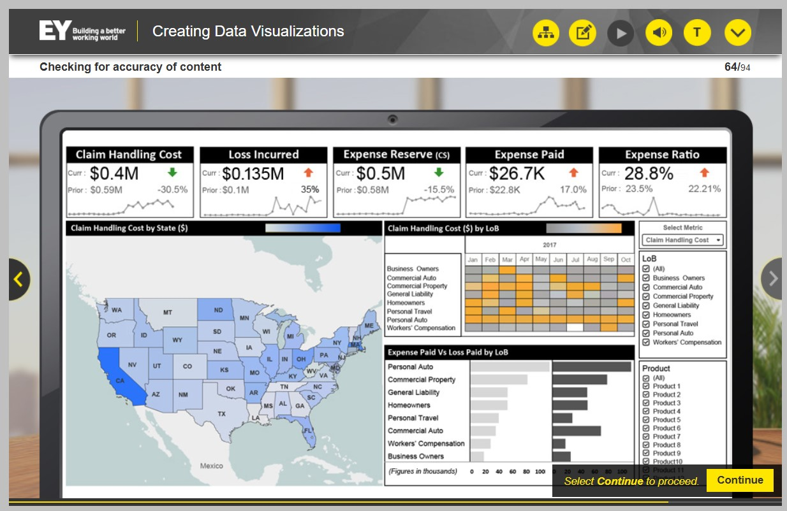

## Lição 4 – Revisar a Visualização de Dados

Você avaliará sua visualização de dados em busca de elementos de design apropriados, direcionando a atenção do público e contando a história dos dados.

### Ao final desta lição, você será capaz de:

- Determinar se o conteúdo de uma visualização de dados é preciso;
- Determinar se a visualização de dados atende aos seus requisitos.

### Introdução - Revisão por Pares

Agora que sua visualização de dados e história foram criadas, você precisa fazer uma autoavaliação dos elementos de design da visualização de dados e também enviá-la para revisão por pares para identificar se o conteúdo da visualização de dados é preciso e está alinhado com os requisitos do cliente.

### Etapas para revisar uma visualização de dados

Há duas etapas envolvidas na revisão da visualização de dados.

### Prática de cenários

A prática de cenários inclui:

- Uma história baseada em projetos reais da EY, apresentada em seções;
- Uma pergunta que você precisa responder com base nas informações disponíveis no momento;
- Informações adicionais para sua história de visualização de dados.

### Aspectos da visualização de dados a serem revisados

Antes de revisar os elementos de design do painel, Hugo decide revisar a visualização de dados para verificar o uso adequado de tipos visuais, princípios de design e layout, a fim de garantir que a atenção do público seja direcionada para informações importantes.

- Consulte os materiais de apoio fornecidos durante a revisão.

**Prompt para a Pergunta 1**

Hugo revisou o painel em comparação com os materiais de apoio, suas anotações e o documento de apoio. Ele confirma que selecionou os tipos visuais apropriados. Agora, ele verifica a precisão geral do painel.

**Questao 1**

Hugo apresentou os seguintes números para os KPIs de Custos de Processamento de Sinistros: tendência atual de 0,4 milhão, tendência do período anterior de 0,59 milhão, tendência geral de queda de -30,5% em relação ao período anterior. Para Perdas Incorridas, ele apresentou os seguintes números: tendência atual de 0,135 milhão, tendência do período anterior de 0,1 milhão, tendência geral de alta de 35% em relação ao período anterior.

**Revise os KPIs de Custos de Processamento de Sinistros e Perdas Incorridas para determinar se o conteúdo está representado com precisão no painel.**

**Resposta:**

**A** - Enquanto os custos de processamento de sinistros mostram uma tendência geral de queda, o gráfico de linhas mostra uma tendência de alta. O inverso se aplica às perdas incorridas. Embora os números verificados sejam precisos e a tendência geral de perdas incorridas seja de alta, o gráfico de linhas mostra uma tendência de baixa.

**— Hugo:** Os gráficos de linhas dos KPIs de "Custo de Tratamento de Sinistros" e "Perdas Incorridas" parecem não refletir o que os números dizem. Devo ter cometido um erro nos números do meu gráfico de linhas.

Deixe-me corrigir isso agora. Eles estão muito melhores.

### Identificando se os elementos de design estão alinhados com os objetivos/necessidades do cliente

**— Hugo:** Todo o resto parece estar correto. Agora preciso pensar na mensagem que quero transmitir ao meu público.

Deixe-me voltar e analisar minhas anotações sobre os objetivos do cliente.

**— Hugo:** Portanto, o conteúdo do painel precisa incluir:
- KPIs sobre custos de tratamento de sinistros;
- Perdas incorridas;
- Reserva de despesas;
- Despesas pagas e índice de despesas ao longo de uma tendência de doze meses;
-  Custo de tratamento de sinistros por localização geográfica (estado por estado);
- Custo de tratamento de sinistros mês a mês por linha de negócios (LoB);
-  Despesa paga vs. perda paga por LoB;
- E filtros para selecionar métricas e filtros para LoB e produtos vendidos.

**Prompt para a pergunta 2**

**— Hugo:** Deixe-me começar verificando se o painel permite que executivos e gerentes identifiquem rapidamente a visão geral operacional da empresa.

**Pergunta:** Consulte o painel e identifique se algum dos seguintes elementos está alinhado com as metas/necessidades do cliente de identificar rapidamente a visão geral operacional da empresa.

**Resposta:**

**C** - O elemento de design dos KPIs na parte superior do painel são as métricas mais importantes para o público e oferecem uma visão geral clara e rápida das operações da empresa.

### Identificar se os elementos de design estão alinhados com as metas/necessidades do cliente: KPIs

**— Hugo:** Preciso pensar em como explicarei cada elemento do painel ao meu público e descrever por que isso os ajudará a atingir suas metas. O público principal do painel são executivos que precisam identificar rapidamente a visão geral operacional da empresa. Assim, posso começar focando nos KPIs sobre custos de processamento de sinistros, perdas incorridas, reserva de despesas, despesas pagas e índice de despesas ao longo de uma tendência de doze meses.

Hugo pensa em como explicaria os KPIs e as mensagens práticas ao seu público.

**— Hugo:** Na parte superior, você pode ver que apresentamos seus KPIs sobre custos de processamento de sinistros, perdas incorridas, reserva de despesas, despesas pagas e índice de despesas. Adicionamos métricas em tempo real sobre seus números atuais para cada KPI aqui, e o trimestre anterior é exibido juntamente com a porcentagem de diferença entre os dois. As setas vermelha e verde fornecem uma maneira rápida de mostrar se seus custos estão se movendo em uma direção financeira positiva – o que é indicado por uma seta verde – ou se há potenciais problemas de risco nas tendências indicadas por uma seta vermelha. O gráfico de linhas na parte inferior de cada célula exibe a tendência de cada KPI nos últimos doze meses.

Acreditamos que esta visão geral dos KPIs atende ao seu objetivo de identificar rapidamente a visão geral operacional da empresa e ajudá-lo a identificar áreas de negócios que justificam uma análise mais aprofundada.

**— Hugo:** OK. Acho que isso deve ajudar a explicar como atingir esse objetivo.

### Identificar se os elementos de design estão alinhados com os objetivos/necessidades do cliente: Custo de tratamento de reclamações por localização geográfica

Hugo decide revisar a visualização usada para o custo de gerenciamento de sinistros por localização geográfica.

**— Hugo:** Hum, deixe-me pensar em como explicar nossa decisão sobre o que usamos para identificar linhas de negócios específicas com tendências de perdas ou ganhos por geografia, tipo de produto e tendências mensais.

Hugo analisa o mapa de calor geográfico do painel e pensa em como explicar a seleção desse tipo de gráfico para seu público e como eles podem usá-lo para atingir seus objetivos.

**— Hugo:** Então, para ajudar você a identificar se linhas de negócios específicas estão apresentando tendências de perdas ou ganhos por geografia, criamos um mapa de calor geográfico para permitir que você tenha uma indicação visual rápida de quais estados podem precisar da sua atenção. 

A legenda no canto superior direito aqui serve para ajudar você a interpretar os dados sobre custos de sinistros por estado. Começando pela extrema esquerda do espectro, o **branco** indica que **não há custos** de gerenciamento de sinistros, enquanto o **azul escuro** indica **altos custos** de gerenciamento de sinistros. Cada estado reflete seus custos individuais de gerenciamento de sinistros por cor. Por exemplo, você pode ver aqui que o estado de **Montana** tem **custos relativamente baixos** de processamento de sinistros, enquanto o estado de **Dakota do Norte** tem **custos médios** de aproximadamente 150.000 dólares e a **Califórnia** tem **custos altos** de processamento de sinistros de aproximadamente 300.000 dólares.

### Identifique se os elementos de design estão alinhados com as metas/necessidades do cliente: Custo de gerenciamento de sinistros por linha de negócios

**— Hugo:** Para os custos de gerenciamento de sinistros por linha de negócios, também usamos um mapa de calor para ajudar você a identificar rapidamente se linhas de negócios específicas apresentam tendências de perdas ou ganhos por tipo de produto e/ou mês.

A legenda no canto superior direito aqui também serve para ajudar você a interpretar os dados sobre custos de sinistros, mas desta vez por linha de negócios e mês. Começando pela extrema esquerda do espectro, o cinza escuro indica que não há custos de gerenciamento de sinistros, enquanto a cor da extrema direita, ou laranja brilhante, indica altos custos de gerenciamento de sinistros.

Na extrema esquerda, você vê as linhas de negócios listadas e pode acompanhá-las no mapa de calor, acompanhando os meses mostrados aqui na parte superior. Agora você pode rastrear a linha de negócios por mês e analisar cada célula para ver a tendência dos custos de gerenciamento de sinistros. Por exemplo, observando o item Imóveis Comerciais para o mês de maio, você pode ver que os custos são bastante baixos; no entanto, para agosto, eles são altos e os custos com Automóveis Pessoais parecem ser altos para o período de janeiro a outubro. Então, o Seguro Auto Pessoal é definitivamente algo que merece investigação.

### Identificar se os elementos de design estão alinhados com os objetivos/necessidades do cliente: Despesas vs. perdas pagas por linha de negócios (LoB)

Hugo verifica em suas anotações quais outros dados e metas ele precisa incluir em sua mensagem.

**— Hugo:** A última visualização que Dante quer é uma comparação entre despesas pagas e perdas pagas por linha de negócios.

Hum, então preciso pensar em como transmitir a seleção dos gráficos de barras de volta ao objetivo do Dante de auxiliar os usuários a decidir se suas perdas e despesas estão associadas a um tipo específico de produto.

Hugo analisa o gráfico de barras do painel sobre despesas pagas versus perdas pagas por linha de negócios.

**— Hugo:** OK, deixe-me tentar o seguinte: um dos elementos do seu painel operacional que você nos pediu para incluir em nosso design era uma maneira de comparar despesas pagas versus perdas pagas por linha de negócios. 

O objetivo era auxiliar executivos e gerentes a decidir se perdas e despesas estão associadas a um tipo específico de produto. Usamos gráficos de barras para mostrar uma comparação fácil de visualizar.

Na extrema esquerda, você pode ver no eixo y a categoria de cada linha de negócios, como Automóveis Pessoais, Imóveis Comerciais e Responsabilidade Civil Geral. As barras cinza-claro indicam as despesas pagas por linha de negócios, enquanto as barras cinza-escuro indicam as perdas pagas por linha de negócios. Na parte inferior do gráfico, você pode ver que o eixo x fornece uma escala numérica para as despesas pagas e as perdas pagas, começando em zero mil para indicar nenhum pagamento e indo até 100 mil para indicar o pagamento máximo. Vamos analisar qual tipo de produto pode estar incorrendo em maiores perdas.

Observando Viagens Pessoais, você pode ver que as despesas pagas são de aproximadamente 40 mil, enquanto as perdas pagas são de cerca de 30 mil, portanto, seu pagamento é moderadamente baixo. No entanto, para Automóveis Pessoais, você pode ver que tanto as despesas pagas quanto as perdas pagas são altas, chegando a aproximadamente 100 mil. Isso indicaria uma linha de negócios que justifica uma investigação mais aprofundada sobre os motivos pelos quais você está vendo números tão altos. Portanto, você pode ver facilmente que a comparação do gráfico de barras pode ajudá-lo a identificar áreas de negócios que justificam uma análise analítica mais aprofundada para identificar as especificidades de uma tendência de perda ou ganho em um mercado.

### Identificar se os elementos de design estão alinhados com os objetivos/necessidades do cliente: Filtros

**— Hugo:** Hmm, há mais alguma coisa que eu precise explicar? Ah, esqueci dos filtros!

Então, os filtros existem principalmente para que os gerentes possam se aprofundar, mas os executivos também podem usá-los ocasionalmente.

Um dos seus pedidos era para que seus gerentes pudessem se aprofundar em uma área. No topo, temos a seleção de métricas, que neste caso são os custos de gerenciamento de sinistros. 

Podemos expandir para outras métricas, se desejar. O segundo filtro aqui é a Linha de Negócios. Você pode escolher selecionar todas as Linhas de Negócios para ver o desempenho geral do gerenciamento de sinistros em toda a empresa ou pode selecionar apenas uma ou várias combinações de Linhas de Negócios. O terceiro filtro é a oferta de produtos. Por exemplo, se você observou um aumento nas perdas no gerenciamento de sinistros de proprietários de empresas, talvez seja interessante analisar a linha de produtos individual para ver se é um produto específico que está aumentando os custos de gerenciamento de sinistros.

### Identificar se os elementos de design estão alinhados com os objetivos/necessidades do cliente: Revisão final

**— Hugo:** Acho que é isso para revisar os elementos de design e explicá-los ao cliente. Deixe-me fazer uma verificação final.

Hugo verifica em suas anotações se explicou cada elemento do painel e os dados associados a ele.

**— Hugo:**  
- ✅ KPIs sobre custos de processamento de sinistros, perdas incorridas, reserva de despesas, despesas pagas e índice de despesas – **sim**; 
- ✅ KPIs ao longo de uma tendência de doze meses – **sim**; 
- ✅ Custo de processamento de sinistros por localização geográfica (estado por estado) – **com certeza tenho esse**; 
- ✅ Custo de processamento de sinistros mês a mês por Linha de Negócios (Linha de Negócios) – **tenho**;
-  ✅ Despesa paga vs. perdas pagas por Linha de Negócios – **tenho esse**; 
- ✅ Filtros para selecionar métricas e filtros para Linha de Negócios e produtos vendidos – **sim**.

✨ Acredito que também atingi e expliquei todas as metas do cliente.

## Conclusão

Em seguida, preciso trabalhar na minha apresentação e torná-la uma história atraente para o cliente.